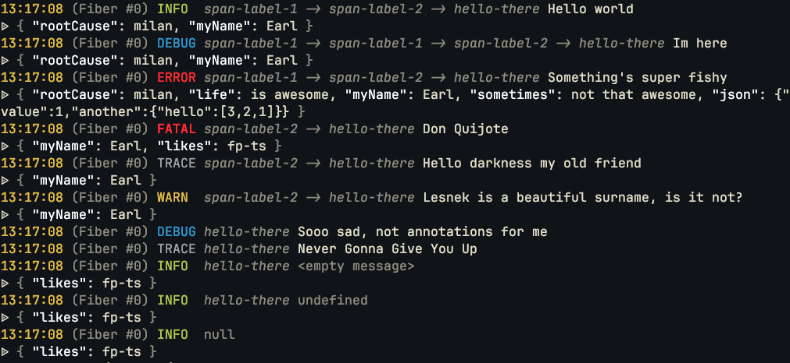
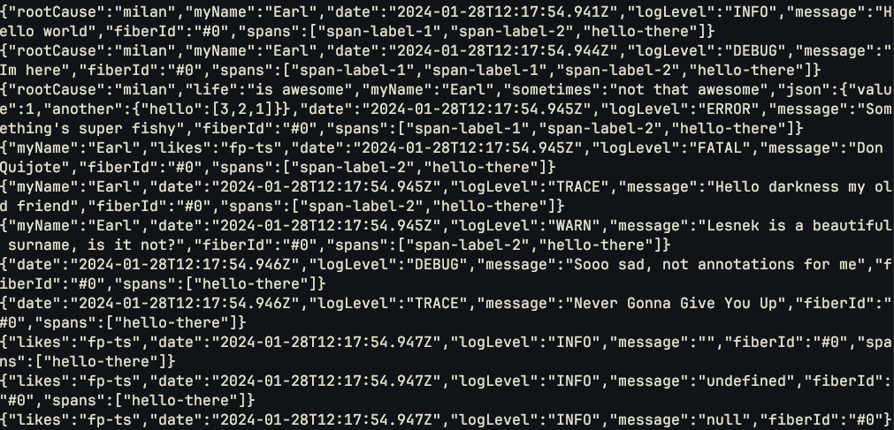

# effect-log

Logging batteris for effect-ts.

## Consider using the official `effect/Logger` instead

Most of the functionality provided by this library is already present directly in the `effect`
package. In case of the pretty logger, you should strongly consider using the 
[Logger.pretty](https://effect-ts.github.io/effect/effect/Logger.ts.html#pretty) instead. And,
in case of the JSON logger, consider using the
[Logger.json](https://effect-ts.github.io/effect/effect/Logger.ts.html#json). Just be aware
of few differences:

- the `Logger.json` includes the log annotations in the `annotations` field, the `JsonLogger.layer()`
  spreads the annotations into the root of the output JSON
- the `Logger.json` outputs the message as an array into the `message` field, the `JsonLogger.layer()`
  concatenates the message into a single string

These decisions about the output JSON format were motivated by the fact that I'm targetting
the Datadog platform. If you want the same output format, you can still achieve it by using
the [Logger.structuredLogger](https://effect-ts.github.io/effect/effect/Logger.ts.html#structuredlogger)
and modifying the output using [Logger.map](https://effect-ts.github.io/effect/effect/Logger.ts.html#map).

## [Pretty logger](examples/pretty-logger.ts)

Use `PrettyLogger.make` to create the pretty logger or `PrettyLogger.layer` to
obtain a layer replacing the default logger. Optionally, these functions
accept an options object configuring what information gets
to the output.

```typescript
import { Effect, pipe } from "effect";
import { PrettyLogger } from "effect-log";

import { exampleEffect } from "./example-logging-effect";

// These are the defaults. You can omit the argument
// completely if you're okay with the defaults.
const logger = PrettyLog.layer({
  showFiberId: true,
  showTime: true,
  showSpans: true,
  enableColors: true,
});

pipe(exampleEffect, Effect.provide(logger), Effect.runSync);
```



## [JSON logger](examples/json-logger.ts)

Use `JsonLogger.make` to create the JSON logger or `JsonLogger.layer` to
obtain a layer replacing the default loggger. Optionally, these functions
accept an options object configuring what information gets
to the output.

```typescript
import { Effect, pipe } from "effect";
import { JsonLogger } from "effect-log";

import { exampleEffect } from "./example-logging-effect";

// These are the defaults. You can omit the argument
// completely if you're okay with the defaults.
const logger = JsonLogger.layer({
  showFiberId: true,
  showTime: true,
  showSpans: true,
  messageField: "message",
});

pipe(exampleEffect, Effect.provide(logger), Effect.runSync);
```


