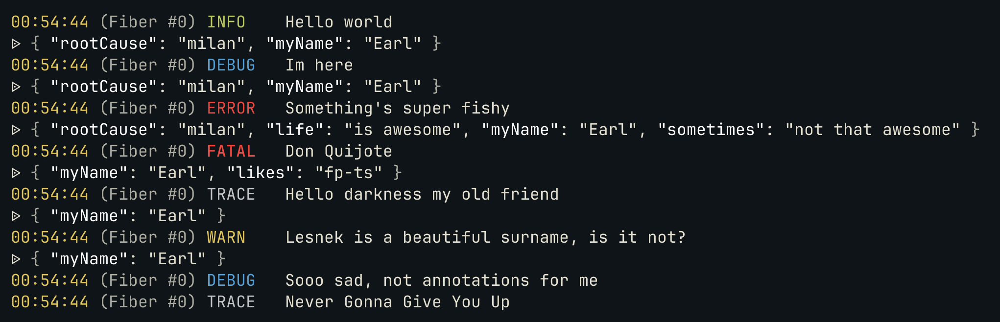
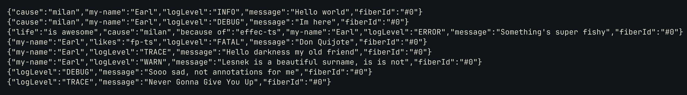

# effect-log

Logging batteris for effect-ts.

## [Pretty logger](examples/pretty-logger.ts)

Use `PrettyLogger.make` to create the pretty logger or `PrettyLogger.layer` to
obtain a layer replacing the default logger. Optionally, these functions
accept an options object configuring what information gets
to the output.

```typescript
import { Effect, pipe } from "effect";
import { PrettyLog } from "effect-log";

import { exampleEffect } from "./example-logging-effect";

// These are the defaults. You can omit the argument
// completely if you're okay with the defaults.
const logger = PrettyLog.layer({
  showFiberId: true,
  showTime: true,
  showSpans: true,
  enableColors: true,
});

pipe(exampleEffect, Effect.provide(logger), Effect.runSync);
```



## [JSON logger](examples/json-logger.ts)

Use `JsonLogger.make` to create the JSON logger or `JsonLogger.layer` to
obtain a layer replacing the default loggger. Optionally, these functions
accept an options object configuring what information gets
to the output.

```typescript
import { Effect, pipe } from "effect";
import { JsonLogger } from "effect-log";

import { exampleEffect } from "./example-logging-effect";

// These are the defaults. You can omit the argument
// completely if you're okay with the defaults.
const logger = JsonLogger.layer({
  showFiberId: true,
  showTime: true,
  showSpans: true,
  messageField: "message",
});

pipe(exampleEffect, Effect.provide(logger), Effect.runSync);
```


